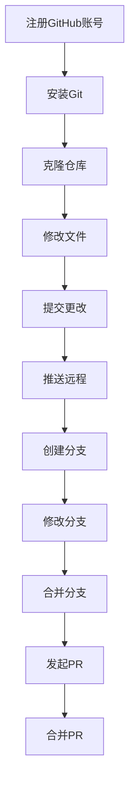

# GitHub教学用示例仓库

## 项目简介

这是一个为非计算机专业研究生设计的GitHub教学用示例仓库，旨在帮助你快速掌握Git和GitHub的基本操作，为AI工具与创新实践课程做好准备。

## 仓库结构

```
├── documents/         # 文档文件夹
├── examples/          # 示例文件文件夹
├── exercises/         # 练习任务文件夹
├── .gitignore         # Git忽略文件配置
└── README.md          # 本说明文件
```

## 第一部分：准备工作

### 1. GitHub账号注册

**步骤1：访问GitHub官网**
- 打开浏览器，访问 [https://github.com](https://github.com)
- 点击右上角的"Sign up"按钮

**步骤2：填写注册信息**
- 输入你的邮箱地址
- 创建一个用户名（建议使用真实姓名或易于识别的名称）
- 设置一个强密码
- 完成验证（可能需要解决一个简单的拼图）

**步骤3：验证邮箱**
- 登录你的邮箱，找到GitHub发送的验证邮件
- 点击邮件中的验证链接

**步骤4：完成注册**
- 回答GitHub的几个问题（可以选择跳过）
- 选择免费计划（Free）
- 完成注册过程

### 2. Git安装指南

#### Windows系统
1. 访问 [Git官网](https://git-scm.com/download/win)
2. 下载最新版本的Git for Windows
3. 运行安装程序，使用默认选项即可
4. 安装完成后，打开命令提示符（CMD）或Git Bash，输入 `git --version` 验证安装成功

#### macOS系统
1. 打开终端（Terminal）
2. 输入 `xcode-select --install` 安装Command Line Tools
3. 或访问 [Git官网](https://git-scm.com/download/mac) 下载安装包
4. 安装完成后，在终端输入 `git --version` 验证安装成功

#### Linux系统
1. 打开终端
2. 根据你的Linux发行版，输入以下命令：
   - Ubuntu/Debian: `sudo apt install git`
   - CentOS/RHEL: `sudo yum install git`
   - Fedora: `sudo dnf install git`
3. 安装完成后，输入 `git --version` 验证安装成功

## 第二部分：基础操作练习

### 1. 克隆仓库到本地

**步骤1：复制仓库URL**
- 在GitHub仓库页面，点击绿色的"Code"按钮
- 复制HTTPS或SSH链接

**步骤2：打开终端/命令提示符**
- Windows: 打开Git Bash或CMD
- macOS/Linux: 打开终端

**步骤3：执行克隆命令**
```bash
git clone https://github.com/你的用户名/仓库名称.git
```

**步骤4：进入仓库目录**
```bash
cd 仓库名称
```

**预期结果**：仓库文件会被下载到本地，你可以看到与GitHub上相同的文件结构。

**常见问题**：
- 克隆失败：检查网络连接，确保URL正确
- 权限错误：如果使用SSH链接，需要设置SSH密钥

### 2. 文件修改练习

**步骤1：打开 `examples/student_info.txt` 文件**
- 在本地仓库中找到该文件
- 用文本编辑器打开

**步骤2：添加个人信息**
- 在文件末尾添加你的姓名、专业和邮箱
- 保存文件

**步骤3：查看修改状态**
```bash
git status
```

**预期结果**：Git会显示 `examples/student_info.txt` 文件已被修改。

### 3. 提交更改

**步骤1：添加更改到暂存区**
```bash
git add examples/student_info.txt
```

**步骤2：提交更改**
```bash
git commit -m "添加个人信息"
```

**步骤3：推送更改到GitHub**
```bash
git push origin main
```

**预期结果**：你的更改会被上传到GitHub仓库，在GitHub页面上可以看到新的提交记录。

**常见问题**：
- 推送失败：可能需要输入GitHub用户名和密码，或设置SSH密钥
- 分支错误：确保你在正确的分支上操作

### 4. 创建分支与合并

**步骤1：创建新分支**
```bash
git checkout -b feature-branch
```

**步骤2：在新分支上进行修改**
- 修改 `examples/notes.md` 文件
- 添加一些课程笔记

**步骤3：提交更改**
```bash
git add examples/notes.md
git commit -m "添加课程笔记"
```

**步骤4：切换回主分支**
```bash
git checkout main
```

**步骤5：合并分支**
```bash
git merge feature-branch
```

**步骤6：推送合并结果**
```bash
git push origin main
```

**预期结果**：新分支的更改会被合并到主分支，GitHub上会显示合并记录。

### 5. 发起Pull Request

**步骤1：在GitHub上创建新分支**
- 访问仓库页面
- 点击"Branch:"下拉菜单
- 输入新分支名称，点击"Create branch"

**步骤2：修改文件**
- 在GitHub网页上直接编辑 `exercises/task1.md` 文件
- 保存更改并提交

**步骤3：发起Pull Request**
- 点击"Pull requests"标签
- 点击"New pull request"按钮
- 选择你刚创建的分支作为源分支
- 填写标题和描述
- 点击"Create pull request"按钮

**步骤4：合并Pull Request**
- 查看Pull Request页面
- 点击"Merge pull request"按钮
- 确认合并

**预期结果**：Pull Request会被成功合并到主分支，所有更改会显示在主分支中。

## 第三部分：练习任务

### 练习1：熟悉仓库结构
**目标**：了解仓库的基本结构和文件组织
**步骤**：
1. 克隆仓库到本地
2. 浏览所有文件夹和文件
3. 了解每个文件的用途
**完成标准**：能够说出仓库中每个文件夹的作用

### 练习2：个人信息添加
**目标**：掌握文件修改和提交的基本操作
**步骤**：
1. 编辑 `examples/student_info.txt` 文件
2. 添加你的个人信息
3. 提交并推送更改
**完成标准**：GitHub上的文件显示你的个人信息

### 练习3：创建课程笔记
**目标**：练习分支创建和合并操作
**步骤**：
1. 创建一个新分支
2. 在 `examples/notes.md` 中添加课程笔记
3. 提交更改并合并到主分支
4. 推送合并结果
**完成标准**：主分支中包含你的课程笔记

### 练习4：协作练习
**目标**：模拟团队成员提交修改
**步骤**：
1. 邀请一个同学作为协作者
2. 同学在 `exercises/collaboration.md` 中添加内容
3. 同学提交并推送更改
4. 你在本地拉取最新更改
**完成标准**：本地仓库包含同学的更改

### 练习5：小型项目实践
**目标**：综合运用Git和GitHub操作
**步骤**：
1. 在 `documents/` 文件夹中创建一个课程笔记文档
2. 组织文档结构，添加内容
3. 提交并推送更改
4. 邀请同学一起编辑文档
**完成标准**：创建一个完整的课程笔记文档，包含多人贡献

## 第四部分：教学辅助材料

### 操作流程图



### 常见错误及解决方案

| 错误信息 | 可能原因 | 解决方案 |
|---------|---------|--------|
| `fatal: repository not found` | 仓库URL错误 | 检查URL是否正确，确保仓库存在 |
| `Permission denied (publickey)` | SSH密钥未设置 | 生成并添加SSH密钥到GitHub |
| `git push: error: failed to push some refs` | 本地分支落后于远程 | 先执行 `git pull` 拉取最新更改 |
| `error: pathspec 'branch-name' did not match any file(s) known to git` | 分支不存在 | 检查分支名称是否正确 |
| `fatal: not a git repository` | 不在Git仓库目录中 | 进入正确的仓库目录 |

### 扩展学习资源

- [GitHub官方文档](https://docs.github.com/)
- [Git官方教程](https://git-scm.com/doc)
- [GitHub Desktop](https://desktop.github.com/) - 图形化Git客户端
- [Git教程 - 廖雪峰](https://www.liaoxuefeng.com/wiki/896043488029600)（中文）
- [GitHub视频教程](https://www.youtube.com/githubguides)（英文）

## 第五部分：学习成果验证清单

- [ ] 成功注册GitHub账号
- [ ] 正确安装Git并验证版本
- [ ] 成功克隆仓库到本地
- [ ] 完成个人信息添加并推送
- [ ] 掌握分支创建和合并操作
- [ ] 成功发起并合并Pull Request
- [ ] 完成所有练习任务
- [ ] 理解Git工作流程
- [ ] 能够独立使用Git和GitHub

## 总结

通过本仓库的练习，你应该已经掌握了Git和GitHub的基本操作，为后续的课程学习和项目实践打下了基础。如果在练习过程中遇到问题，可以参考常见错误解决方案，或寻求老师和同学的帮助。

祝你学习愉快！